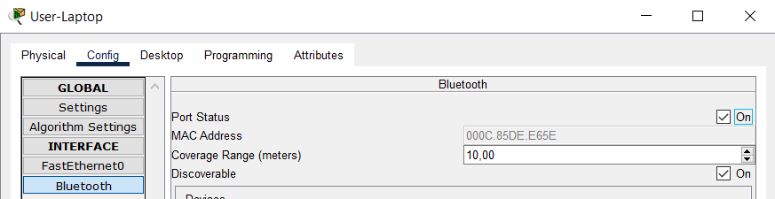
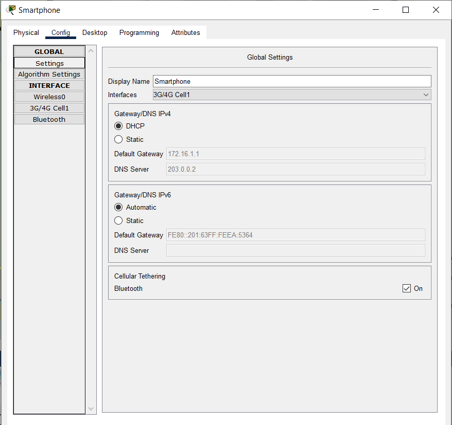
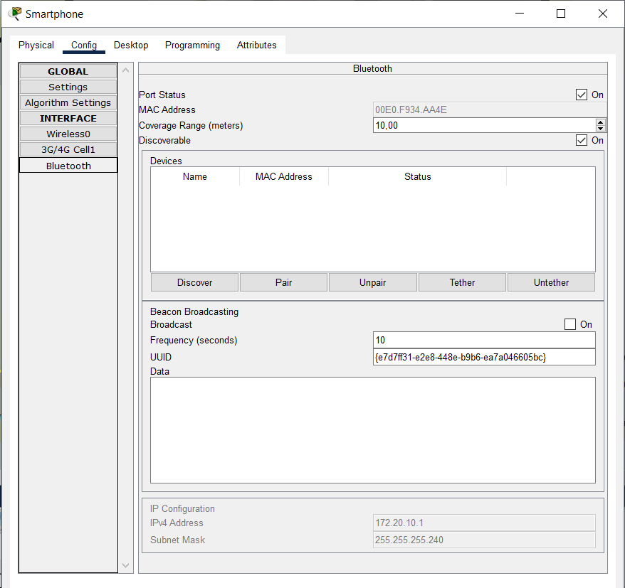
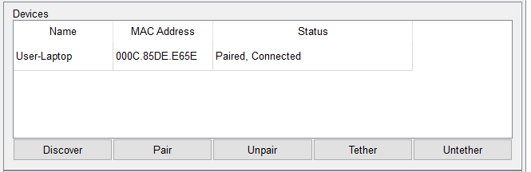
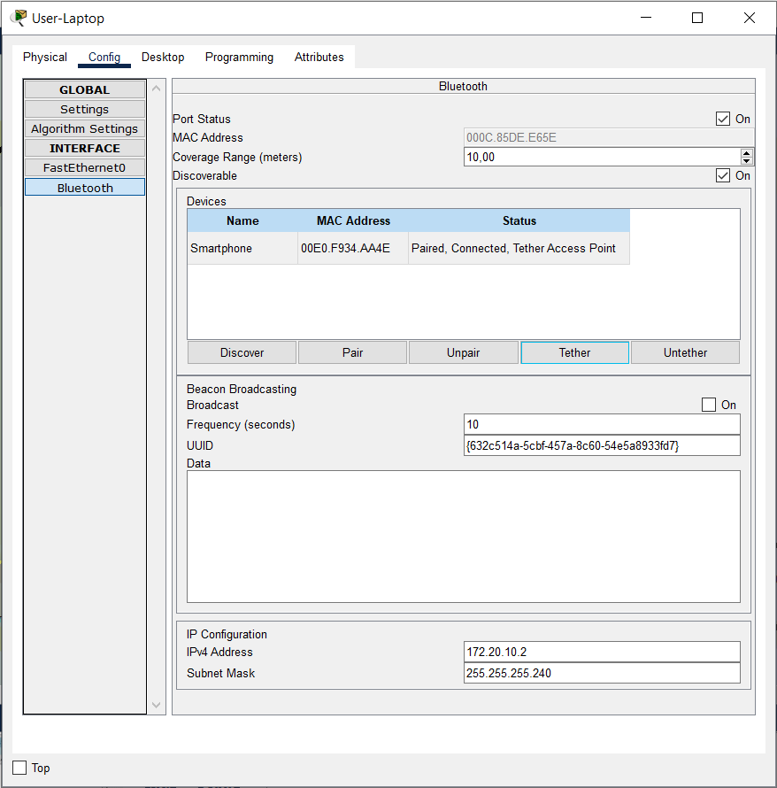

# Packet Tracer - Connect Devices using Wireless Technologies

## Part 1 : Connect a Laptop to the Office WLAN

### Step 1: Install a wireless module to a Laptop

1. Click the Laptop to open the configuration window.

2. Under the Physical tab, power off the Laptop by clicking the power button.

3. Remove the Ethernet module PT-LAPTOP-NM-1CFE from the laptop by dragging it from the Laptop to the list on the left.

4. Insert the wireless module WPC300N by dragging it from the list on the left to the Laptop.

5. Power on the Laptop.

### Step 2: Connect Laptop to the office WLAN

1. Click the Desktop tab and select the PC Wireless tool.

2. Click the Connect tab and wait until the Employee SSID WLAN is displayed. Note that you may have to click Refresh.

3. Click the Employee SSID to select it. Click Connect.

4. Enter Cisco123 as the pre-shared key and click Connect.

5. After connecting to the wireless network, close the PC Wireless window.

6. Click the Config tab and select Wireless0 in the left pane to verify in the IP Configuration section that the Laptop has been assigned an IP address.

7. Open the Web Browser from the Desktop. Navigate to office.srv to verify that the Laptop has connectivity.

8. Close the Laptop window.

## Part 2: Connect Devices with Bluetooth Technology

### Step 1: Enable Bluetooth ports on devices

1. Click the Bluetooth Speaker.

2. Click the Config tab.

3. Click Bluetooth on the left pane and check that the Port Status is On. Note that the speaker is not paired with the Office Tablet.

### Step 2: Connect Bluetooth devices

1. Open the Office Tablet.

2. Click the Config tab.

3. Click Bluetooth in the left pane and check the On box for Port Status.

4. Click Discover and the Bluetooth Speaker device should be discovered.

5. Select the Bluetooth Speaker in the Devices list and click Pair. The status should change to “Paired, Connected”. If prompted for permission to connect, click Yes.

6. To test the Bluetooth connection, click the Desktop tab and select Music Player. Click Play/Stop to start the music. Note: Make sure your speaker is on.

7. Click Play/Stop again to stop the sound.

## Part 3: Tether a Laptop to Use a Cellular Network via the Smartphone

### Step 1: Enable Bluetooth on the Laptop

1. Click the User-Laptop. Select the Config tab.

2. Click Bluetooth on the left panel. Click On for the Port Status.

3. Leave the User-Laptop Bluetooth window open.

### Step 2: Connect a smartphone to the Cellular network and enable Bluetooth

1. Click the Smartphone to open the configuration window.

2. Click the Config tab. Check the On box for the Cellular Tethering setting in the Global Settings.

3. Click the 3G/4G Cell1 interface. Verify that the Smartphone has an IP address from the cellular network.

4. Click Bluetooth in the left pane and check the On box for the Port status on the Smartphone.

### Step 3: Connect Bluetooth devices and tethering to laptop

1. On the Bluetooth configuration for the Smartphone, click Discover to search for nearby Bluetooth enabled-devices.

Note: If Smartphone does not appear after a while, move Smartphone closer to User-Laptop and click Discover again.

2. Select User-Laptop and click Pair. A pop-up window appears and asks for permission. Click Yes. The two devices are connected via Bluetooth.

3. Return to the User-Laptop. In the Bluetooth panel of the Config tab, highlight Smartphone and click Tether.

4. At the bottom pane of the Bluetooth configuration, notice that User-Laptop has now obtained an IP address.

5. To test connectivity, navigate to office.srv. Click Desktop > Web Browser. Enter office.srv in the URL field. You can fast forward time to speed up the process.

