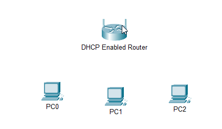
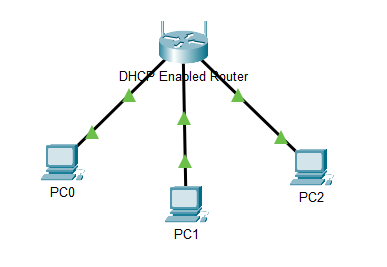
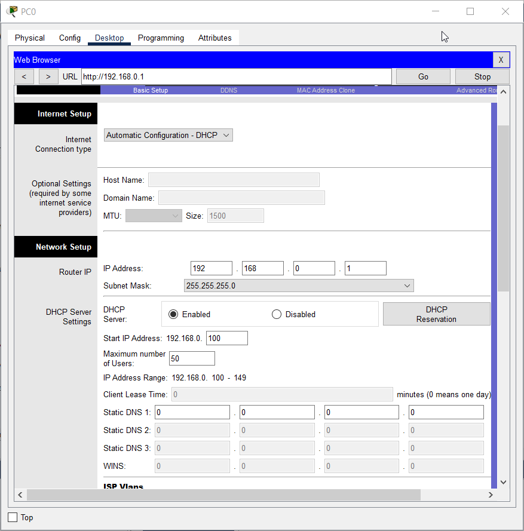
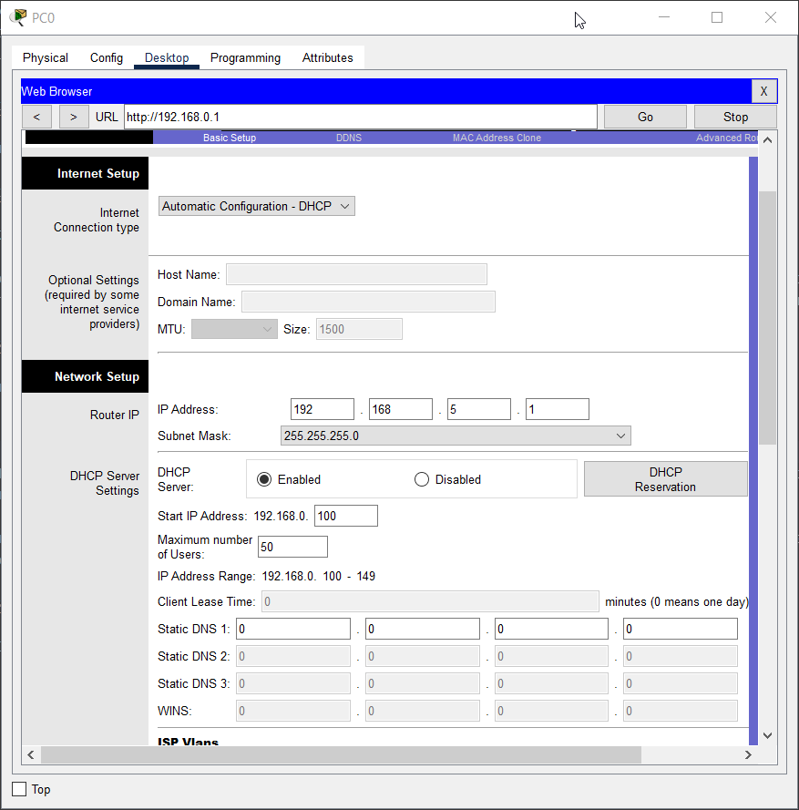
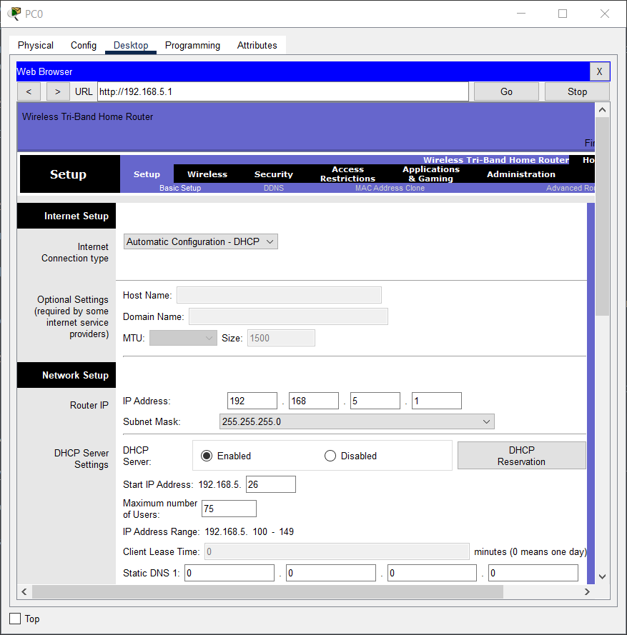
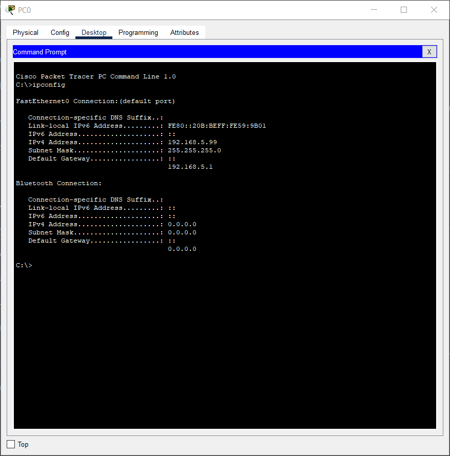
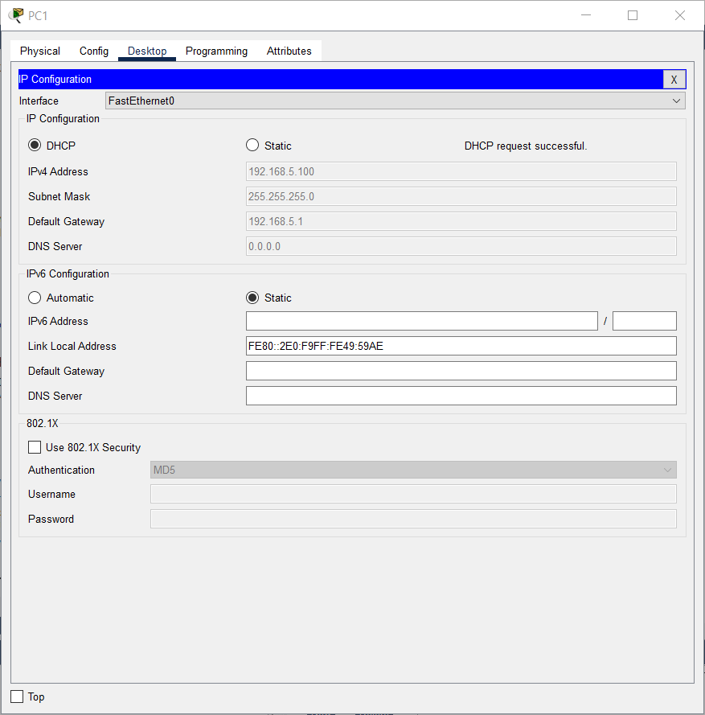
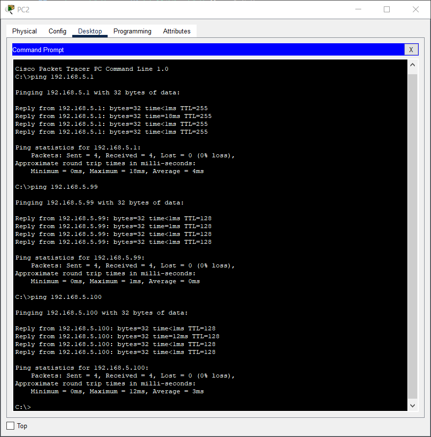

# 11.2.3 Packet Tracer - Налаштування DHCP на бездротовому маршрутизаторі

## Цілі та задачі

- Під'єднайте 3 ПК до бездротового маршрутизатора
- Змініть налаштування DHCP на певний діапазон мережі
- Налаштуйте клієнтів для отримання їх адреси через DHCP

## Довідкова інформація / Сценарій

Домашній користувач хоче використовувати бездротовий маршрутизатор для під'єднання 3 ПК. Усі 3 ПК повинні отримувати свою адресу автоматично від бездротового маршрутизатора.

## Частина 1: Налаштування мережної топології

1. Додайте три загальних ПК.

    

2. Під'єднайте кожен ПК до порту Ethernet до бездротового маршрутизатора за допомогою прямого кабелю.

    

## Частина 2: Дотримуйтесь стандартних налаштувань DHCP

- Після того, як бурштинові вогні стануть зеленими, натисніть PC0. Перейдіть на вкладку Desktop. Виберіть IP Configuration. Виберіть DHCP, щоб отримати IP-адресу від маршрутизатора з підтримкою DHCP. Запишіть IP-адресу шлюзу за замовчуванням.

    

- Закрийте вікно IP Configuration.

- Відкрийте Web Browser.

- Введіть IP-адресу шлюзу за замовчуванням, записану раніше, у поле URL. Коли буде запропоновано, введіть ім’я користувача admin і пароль admin.

- Прокрутіть сторінку Basic Setup, щоб переглянути налаштування за замовчуванням, включаючи IP-адресу за замовчуванням бездротового маршрутизатора.

    

## Частина 3: Змініть IP-адресу бездротового маршрутизатора за замовчуванням

- У розділі Налаштування IP маршрутизатора змініть IP-адресу на: `192.168.5.1`.

    

- Прокрутіть донизу сторінки та натисніть Save Settings.

- Якщо це зроблено правильно, на веб-сторінці з’явиться повідомлення про помилку. Закрийте веб-браузер.

- Натисніть IP Configuration для відновлення призначеної IP-адреси. Натисніть Static. Натисніть DHCP, щоб отримувати нову інформацію про IP-адресу від бездротового маршрутизатора.

    

- Відкрийте веб-браузер, введіть IP-адресу `192.168.5.1` в URL поле. Коли буде запропоновано, введіть ім’я користувача `admin` і пароль `admin`.

## Частина 4: Змініть діапазон адрес DHCP за замовчуванням

- Зверніть увагу, що початкову IP-адресу DHCP-сервера оновлено до тієї ж мережі, що й IP-адресу маршрутизатора.

- Змініть початкову IP-адресу з `192.168.5.100` на `192.168.5.26`.

- Змініть максимальну кількість користувачів на 75.

    

- Прокрутіть донизу сторінки та натисніть Save Settings. Закрийте веб-браузер.

- Натисніть IP Configuration для відновлення призначеної IP-адреси. Натисніть Static. Натисніть DHCP для отримання нової інформації про IP-адресу від бездротового маршрутизатора.

- Виберіть Command Prompt. Введіть `ipconfig`.

    

## Частина 5: Увімкніть DHCP на інших ПК

- Клацніть PC1.

- Виберіть вкладку Desktop.

- Виберіть IP Configuration.

- Натисніть DHCP. Запишіть IP-адресу для PC1.

    

- Закрийте вікно конфігурації.

- Ввімкніть DHCP на PC2, виконуючи кроки для PC1.

    

## Частина 6: Перевірте з’єднання

- Натисніть PC2 і виберіть вкладку Desktop.

- Виберіть Command Prompt.

- Введіть `ipconfig` у рядку, щоб переглянути конфігурацію IP.

- Введіть ping `192.168.5.1`, щоб пропінгувати бездротовий маршрутизатор.

- Введіть ping `192.168.5.99`, щоб перевірити PC0.

- Коли з’явиться запит, введіть ping `192.168.5.100`, щоб пропінгувати PC1.

- Пінг на всіх пристроях має бути успішним.

    