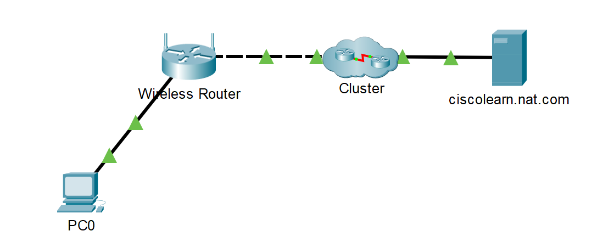
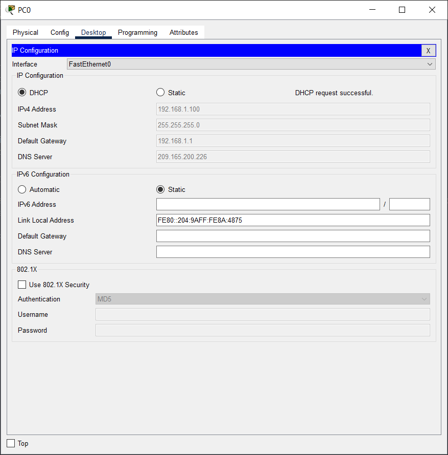
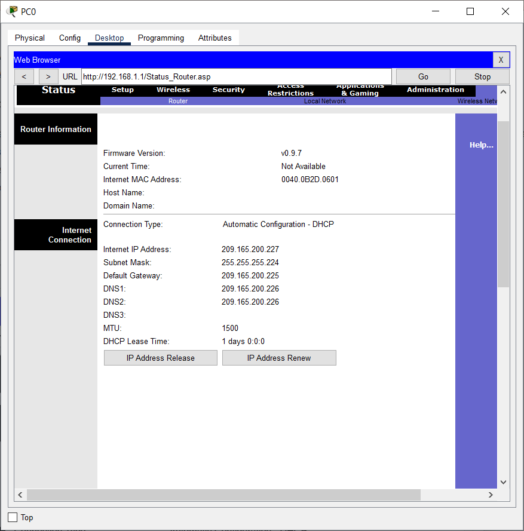
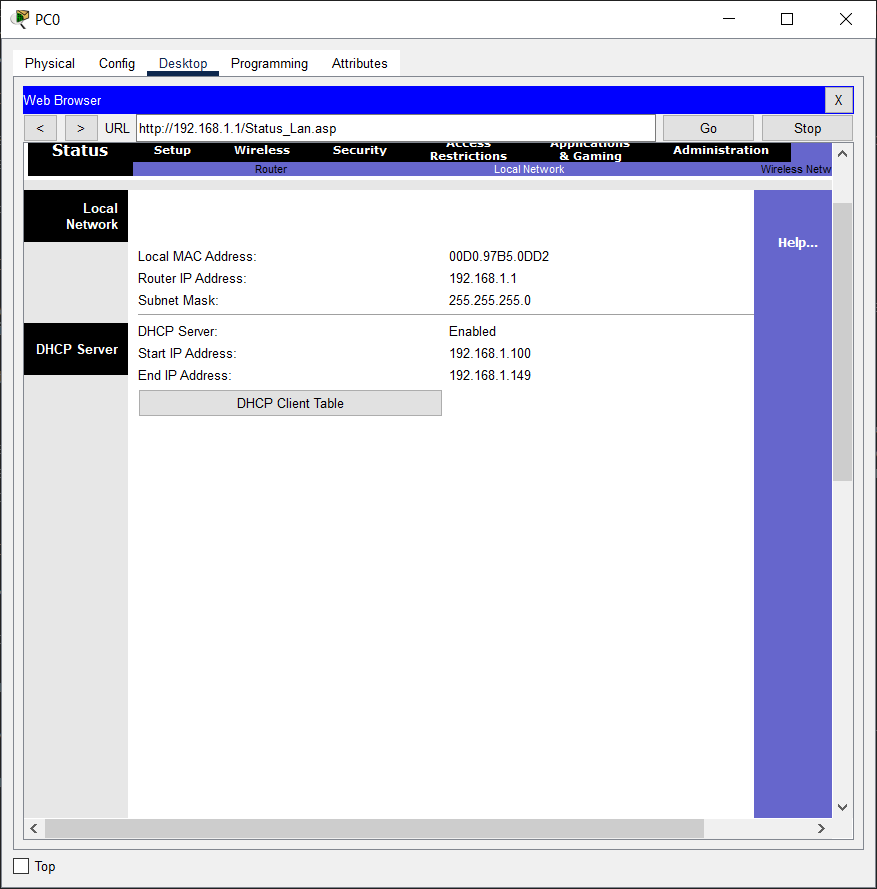
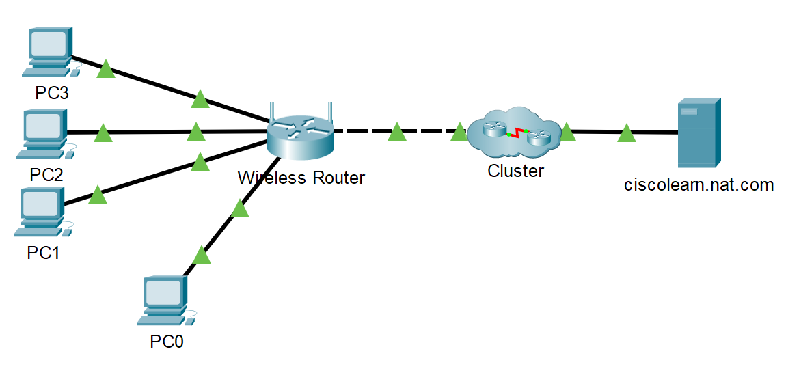
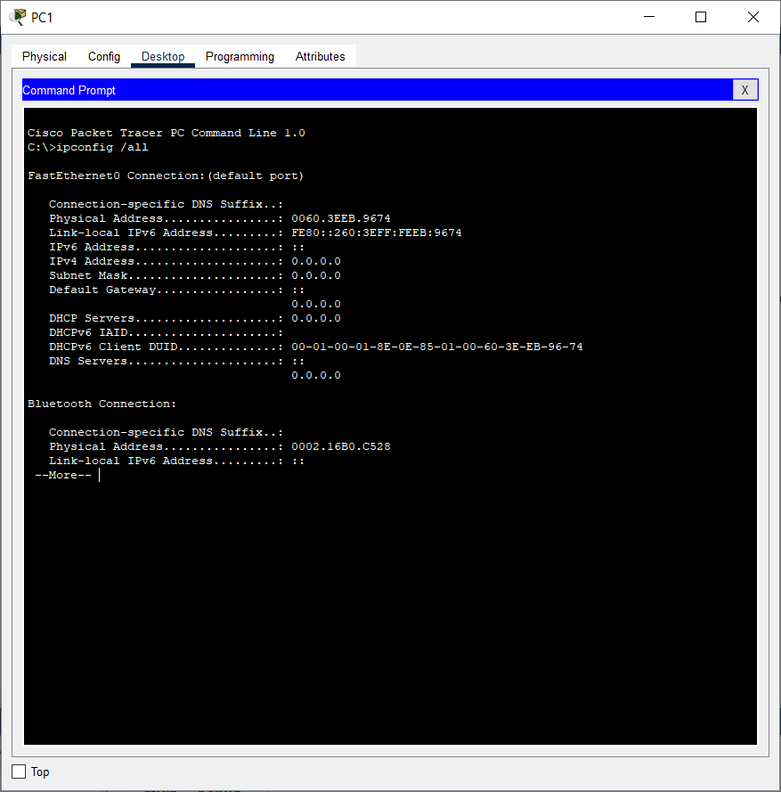

# 12.2.2 Packet Tracer – Перевірка NAT на бездротовому маршрутизаторі

## Цілі та задачі

- Перевірка NAT конфігурації на бездротовому маршрутизаторі
- Налаштування чотирьох ПК для підключення до бездротового маршрутизатора за допомогою DHCP
- Перевірка трафіку, що проходить через мережу із використанням NAT

## Частина 1: Перевірка конфігурації для доступу до зовнішньої мережі

- Додайте один ПК і під’єднайте його до бездротового маршрутизатора за допомогою прямого кабелю. Зачекайте, коли всі індикатори стануть зеленими, перш ніж перейти до наступного кроку або натисніть Fast Forward.

    

- На ПК, натисніть Desktop. Виберіть IP Configuration. Натисніть DHCP, щоб кожен пристрій міг отримувати IP-адресу через DHCP на бездротовому маршрутизаторі.

- Зверніть увагу на IP-адресу шлюзу за замовчуванням. Закрийте IP Configuration, коли закінчите.

    

- Перейдіть до веббраузера і введіть IP-адресу шлюзу за замовчуванням у полі URL-адреси. Введіть ім’я користувача admin і пароль admin, коли з’явиться відповідний запит.

- Натисніть вкладку Status у меню у верхньому правому куті. Після вибору відображається сторінка підменю Router.

- Прокрутіть сторінку маршрутизатора донизу до опції підключення до Інтернету. Вказана тут IP-адреса – це адреса, призначена провайдером. Якщо IP-адреса відсутня (відображається 0.0.0.0), закрийте вікно, зачекайте декілька секунд і спробуйте ще раз. Бездротовий маршрутизатор перебуває в процесі отримання IP-адреси від ISP DHCP-сервера. Адреса, яку ми бачимо тут, – це адреса, призначена Інтернет-порту бездротового маршрутизатора.

    

## Частина 2: Перевірка налаштувань для доступу до внутрішньої мережі

- Натисніть вкладку Local Network в рядку підменю Status.

- Прокрутіть донизу, щоб переглянути інформацію про локальну мережу. Це адреса, що призначена внутрішній мережі.

- Прокрутіть далі донизу, щоб переглянути інформацію про сервер DHCP та діапазон IP-адрес, які можна призначити підключеним хостам.

- Закрийте вікно налаштування бездротового маршрутизатора.

    

## Частина 3: Під’єднання трьох ПК до бездротового маршрутизатора

- Додайте ще три ПК та під’єднайте їх до бездротового маршрутизатора за допомогою прямих кабелів. Зачекайте, коли всі індикатори стануть зеленими, перш ніж перейти до наступного кроку або натисніть Fast Forward.

    

- На кожному комп’ютері натисніть Desktop. Виберіть IP Configuration. Натисніть DHCP, щоб кожен пристрій міг отримувати IP-адресу через DHCP на бездротовому маршрутизаторі. Закрийте IP Configuration, коли закінчите.

- Натисніть піктограму Command Prompt для того, щоб перевірити на кожному ПК конфігурацію IP, використовуючи команду ipconfig /all.

    