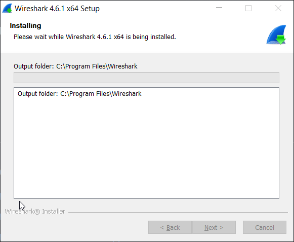
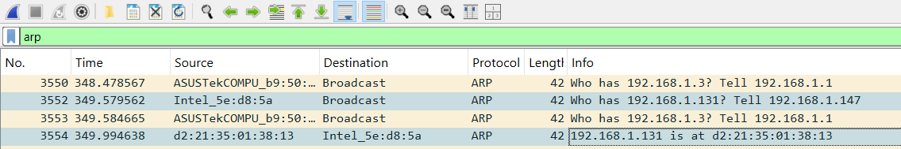
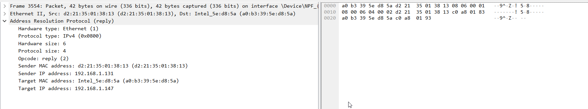

# 4.2.6 Лабораторна робота – Перегляд захопленого трафіку у Wireshark

## Довідкова інформація / Сценарій

Протокол визначення адрес (Address Resolution Protocol, ARP) використовується TCP/IP для зіставлення адреси IP Рівня 3 з MAC-адресою Рівня 2. Коли кадр Ethernet передається в мережі, він повинен мати MAC-адресу призначення.Щоб динамічно виявити MAC-адресу відомого пункту призначення, пристрій-джерело надсилає широкомовний ARP-запит у локальній мережі.Пристрій, на якому налаштовано IPv4-адресу призначення, відповідає на запит ARP-відповіддю, а MAC-адреса записується в ARP-кеш.

Кожен пристрій в локальній мережі підтримує власний ARP-кеш. ARP-кеш - це невелика область оперативної пам’яті, яка зберігає ARP-відповіді. Перегляд ARP-кешу на ПК показує IPv4- та MAC-адреси кожного пристрою в локальній мережі, з яким ПК обмінювався ARP-повідомленнями.

Wireshark - це програмний аналізатор протоколів або програма «пакетний сніфер», що використовується для пошуку та усунення несправностей мережі, аналізу повідомлень, розробки програм та протоколів, а також для навчання. Коли потоки даних проходять через мережу, сніффер «перехоплює» кожну одиницю даних протоколу (PDU) і може декодувати та аналізувати їхній вміст відповідно до специфікацій протоколу.

Wireshark є корисним інструментом для всіх, хто працює з мережами, і його можна використовувати в більшості лабораторних робіт на курсах Cisco для аналізу даних та усунення несправностей. В цій лабораторній роботі даються інструкції щодо завантаження та встановлення Wireshark, хоча застосунок вже може бути встановлений. У цій лабораторній роботі ви будете використовувати Wireshark для перехоплення ARP-повідомлень в локальній мережі.

## Необхідні ресурси

- 1 ПК (Windows 10)
- Доступ до Інтернету
- Інші ПК у локальній мережі (LAN) використовуватимуться для відповіді на запити ping. Якщо в локальній мережі немає інших ПК, адреса шлюзу за замовчуванням використовуватиметься для відповіді на запити ping.

## Частина 1: Завантаження та встановлення Wireshark



## Частина 2: Захоплення та аналіз даних ARP у Wireshark

### Крок 1: Отримайте адреси інтерфейсу вашого ПК

```
ipconfig /all

Windows IP Configuration

   Host Name . . . . . . . . . . . . : DESKTOP-QITDK0N
   Primary Dns Suffix  . . . . . . . :
   Node Type . . . . . . . . . . . . : Hybrid
   IP Routing Enabled. . . . . . . . : No
   WINS Proxy Enabled. . . . . . . . : No
   DNS Suffix Search List. . . . . . : router.local

Ethernet adapter Ethernet:

   Media State . . . . . . . . . . . : Media disconnected
   Connection-specific DNS Suffix  . :
   Description . . . . . . . . . . . : Realtek PCIe GbE Family Controller
   Physical Address. . . . . . . . . : 74-D4-DD-58-67-39
   DHCP Enabled. . . . . . . . . . . : Yes
   Autoconfiguration Enabled . . . . : Yes


Wireless LAN adapter Wi-Fi:

   Connection-specific DNS Suffix  . : router.local
   Description . . . . . . . . . . . : Intel(R) Wi-Fi 6 AX203
   Physical Address. . . . . . . . . : A0-B3-39-5E-D8-5A
   DHCP Enabled. . . . . . . . . . . : Yes
   Autoconfiguration Enabled . . . . : Yes
   Link-local IPv6 Address . . . . . : fe80::7e1b:fda7:957b:2ccb%12(Preferred)
   IPv4 Address. . . . . . . . . . . : 192.168.1.147(Preferred)
   Subnet Mask . . . . . . . . . . . : 255.255.255.0
   Lease Obtained. . . . . . . . . . : 20 листопада 2025 р. 14:56:52
   Lease Expires . . . . . . . . . . : 21 листопада 2025 р. 14:56:52
   Default Gateway . . . . . . . . . : 192.168.1.1
   DHCP Server . . . . . . . . . . . : 192.168.1.1
   DHCPv6 IAID . . . . . . . . . . . : 228635449
   DHCPv6 Client DUID. . . . . . . . : 00-01-00-01-2E-6E-BE-86-74-D4-DD-58-67-39
   DNS Servers . . . . . . . . . . . : 192.168.1.3
                                       1.1.1.1
   Primary WINS Server . . . . . . . : 192.168.1.1
   NetBIOS over Tcpip. . . . . . . . : Enabled
```

IP-адреса - `192.168.1.147`.

## Крок 2: Запустіть Wireshark і почніть захоплювати дані

- На своєму ПК натисніть кнопку Старт (Start) і введіть Wireshark. У вікні результатів пошуку натисніть Wireshark Desktop App.

- Після запуску Wireshark виберіть мережний інтерфейс, який ви ідентифікували за допомогою команди ipconfig. Введіть arp у фільтрі. Цей параметр налаштовує Wireshark на відображення лише тих пакетів, які є частиною ARP-обміну між пристроями в локальній мережі. Після того, як ви вибрали правильний інтерфейс і ввели інформацію про фільтр, натисніть кнопку Почати перехоплення пакетів (Start capturing packets) (піктограма з акулячим плавником), щоб почати перехоплення даних.

- Інформація почне прокручуватися вниз у верхній частині вікна Wireshark. Кожен рядок являє собою повідомлення, яке надсилається між джерелом та пристроєм призначення в мережі.

- У вікні командного рядка надішліть запит ping на шлюз за замовчуванням, щоб перевірити доступність адреси шлюзу за замовчуванням, яка була визначена в Частині 2, Крок 1.

    ```ping 192.168.1.131

    Pinging 192.168.1.131 with 32 bytes of data:
    Reply from 192.168.1.131: bytes=32 time=619ms TTL=64
    Reply from 192.168.1.131: bytes=32 time=101ms TTL=64
    Reply from 192.168.1.131: bytes=32 time=104ms TTL=64
    Reply from 192.168.1.131: bytes=32 time=135ms TTL=64

    Ping statistics for 192.168.1.131:
        Packets: Sent = 4, Received = 4, Lost = 0 (0% loss),
    Approximate round trip times in milli-seconds:
        Minimum = 101ms, Maximum = 619ms, Average = 239ms
    ```

- Зупиніть перехоплення даних, натиснувши значок Зупинити перехоплення (Stop Capture) (піктограма з червоним квадратом).

### Крок 3: Перегляньте захоплені дані

Після виконання команди ping з’явилися наступні ARP пакети:



### Крок 4: Визначте кадр ARP- відповіді, який відповідає виділеному ARP-запиту



### Частина 3: Перевірте записи ARP- кешу на ПК

Відкрийте вікно командного рядка. Введіть команду arp –a та натисніть клавішу Enter.

```arp -a

Interface: 192.168.1.147 --- 0xc
  Internet Address      Physical Address      Type
  192.168.1.1           c8-7f-54-b9-50-80     dynamic
  192.168.1.131         d2-21-35-01-38-13     dynamic
  192.168.1.255         ff-ff-ff-ff-ff-ff     static
  224.0.0.22            01-00-5e-00-00-16     static
  224.0.0.251           01-00-5e-00-00-fb     static
  224.0.0.252           01-00-5e-00-00-fc     static
  239.255.102.18        01-00-5e-7f-66-12     static
  255.255.255.255       ff-ff-ff-ff-ff-ff     static
```
