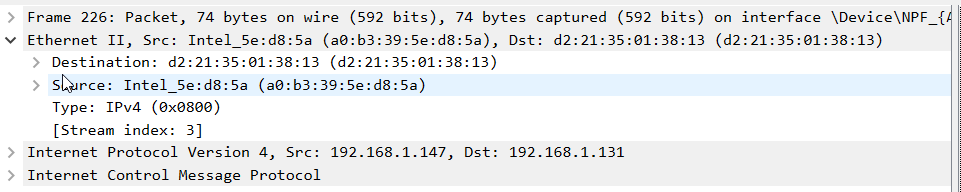
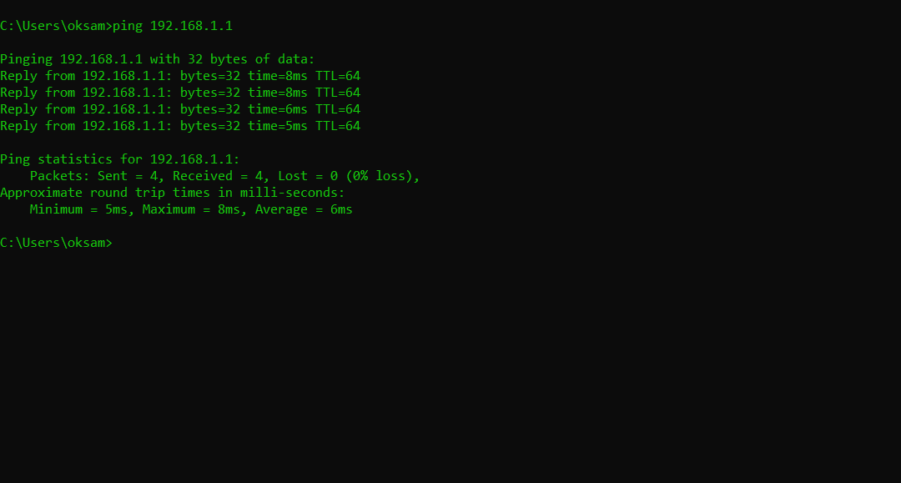
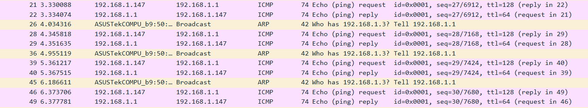
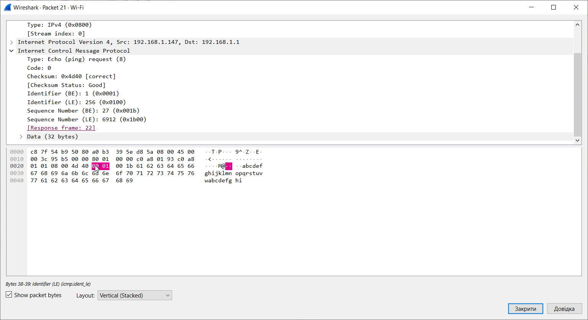

# 4.2.7 Лабораторна робота - Використання Wireshark для перевірки кадрів Ethernet

## Довідкова інформація / Сценарій

Коли протоколи верхнього рівня взаємодіють між собою, дані проходять вниз по моделі взаємного з’єднання відкритих систем (OSI) і інкапсулюються до кадру Рівня 2. Склад кадру залежить від типу доступу до середовища передавання даних. Наприклад, якщо протоколами верхнього рівня є TCP та IP, а доступ до середовища передавання даних Ethernet, то інкапсуляція кадру Рівня 2 буде Ethernet II. Це характерно для локальної мережі.

Вивчаючи концепції Рівня 2, корисно аналізувати інформацію заголовка кадру. У Частині 1 ви проаналізуєте поля, що містяться в кадрі Ethernet II. В Частині 2 ви використовуватимете Wireshark для захоплення і аналізу полів заголовка кадру Ethernet II для локального та віддаленого трафіку.

## Необхідні ресурси

- 1 ПК (операційна система на вибір із встановленим Wireshark)
- Доступ до Інтернету

## Частина 1: Дослідження полів заголовка кадру Ethernet II

### Крок 1: Ознайомтесь з описом і довжиною полів заголовка Ethernet II
### Крок 2: Дослідіть мережні налаштування ПК

```
ipconfig /all

Windows IP Configuration

   Host Name . . . . . . . . . . . . : DESKTOP-QITDK0N
   Primary Dns Suffix  . . . . . . . :
   Node Type . . . . . . . . . . . . : Hybrid
   IP Routing Enabled. . . . . . . . : No
   WINS Proxy Enabled. . . . . . . . : No
   DNS Suffix Search List. . . . . . : router.local

Ethernet adapter Ethernet:

   Media State . . . . . . . . . . . : Media disconnected
   Connection-specific DNS Suffix  . :
   Description . . . . . . . . . . . : Realtek PCIe GbE Family Controller
   Physical Address. . . . . . . . . : 74-D4-DD-58-67-39
   DHCP Enabled. . . . . . . . . . . : Yes
   Autoconfiguration Enabled . . . . : Yes


Wireless LAN adapter Wi-Fi:

   Connection-specific DNS Suffix  . : router.local
   Description . . . . . . . . . . . : Intel(R) Wi-Fi 6 AX203
   Physical Address. . . . . . . . . : A0-B3-39-5E-D8-5A
   DHCP Enabled. . . . . . . . . . . : Yes
   Autoconfiguration Enabled . . . . : Yes
   Link-local IPv6 Address . . . . . : fe80::7e1b:fda7:957b:2ccb%12(Preferred)
   IPv4 Address. . . . . . . . . . . : 192.168.1.147(Preferred)
   Subnet Mask . . . . . . . . . . . : 255.255.255.0
   Lease Obtained. . . . . . . . . . : 20 листопада 2025 р. 14:56:52
   Lease Expires . . . . . . . . . . : 21 листопада 2025 р. 14:56:52
   Default Gateway . . . . . . . . . : 192.168.1.1
   DHCP Server . . . . . . . . . . . : 192.168.1.1
   DHCPv6 IAID . . . . . . . . . . . : 228635449
   DHCPv6 Client DUID. . . . . . . . : 00-01-00-01-2E-6E-BE-86-74-D4-DD-58-67-39
   DNS Servers . . . . . . . . . . . : 192.168.1.3
                                       1.1.1.1
   Primary WINS Server . . . . . . . : 192.168.1.1
   NetBIOS over Tcpip. . . . . . . . : Enabled
```

IP-адреса мого ПК - `192.168.1.147`.

### Крок 3: Дослідіть кадри Ethernet у захопленні Wireshark



## Частина 2: Використання Wireshark для захоплення та аналізу кадрів Ethernet

В цій частині ви використовуватимете Wireshark для захоплення локальних і віддалених кадрів Ethernet. Потім ви досліджуватимете інформацію, яка міститься в полях заголовка кадру.

### Крок 1: Визначте IP-адресу шлюзу за замовчуванням на вашому ПК

IPv4 адреса шлюзу за замовчуванням для мого ПК - 192.168.1.1.

### Крок 2: Почніть захоплення трафіку на мережній карті вашого ПК

Відкрийте Wireshark, щоб почати захоплення даних. Подвійним натисненням оберіть потрібний інтерфейс мережного пристрою з трафіком, щоб почати перехоплення.
Спостерігайте за трафіком, який з’являється у вікні з переліком пакетів.

### Крок 3: Застосуйте фільтр у Wireshark для відображення тільки трафіку ICMP

Ви можете використовувати в Wireshark фільтр для блокування видимості небажаного трафіку. Фільтр не блокує захоплення небажаних даних, він лише фільтрує те, що ви хочете відобразити на екрані. Зараз відображається лише трафік ICMP. В полі Wireshark Фільтр (Filter) введіть icmp. Поле має набути зеленого кольору, якщо ви правильно ввели значення для фільтру. Якщо поле зеленого кольору, натисніть кнопку Застосувати (Apply) (стрілка вправо), щоб застосувати цей фільтр.

### Крок 4: У вікні командного рядка пропінгуйте шлюз за замовчуванням вашого ПК

У вікні командного рядка пропінгуйте шлюз за замовчуванням, використовуючи ІP-адресу, записану на Кроці 1.



### Крок 5: Зупиніть захоплення трафіку на NIC

Натисніть на значок Зупинити захоплення пакетів (Stop Capturing Packets)(червоний прямокутник), щоб зупинити захоплення трафіку.



### Крок 6: Дослідіть перший Echo (ping) запит у Wireshark


